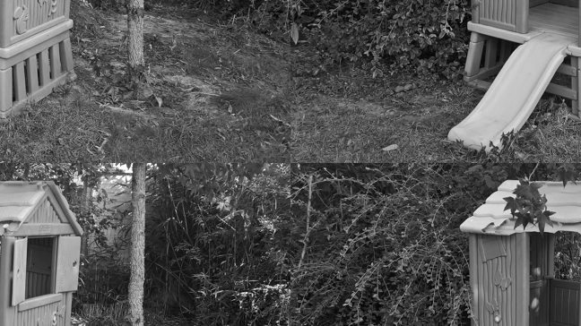
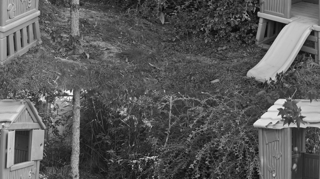

# moisan2011

This is a Python implementation of Moisan's periodic-plus-smooth decomposition
of an image (L. Moisan, Periodic Plus Smooth Image Decomposition, Journal of
Mathematical Imaging and Vision 39(2), 161–179) see
[doi:10.1007/s10851-010-0227-1](https://doi.org/10.1007/s10851-010-0227-1)
(published version), or
[hal-00388020](https://hal.archives-ouvertes.fr/hal-00388020) (archived
version).

The ``moisan2011`` module is released under a BSD 3-clause license (see
``LICENSE``).

## Requirements

You need a fairly recent version of [numpy](http://www.numpy.org/) and [scipy](https://www.scipy.org/scipylib/index.html).

## Installation

Clone this repository

    git clone https://github.com/sbrisard/moisan2011.git

then run the following command

    python setup.py install

You can also run the tests (requires [pytest](https://pytest.org/) and [skimage](http://scikit-image.org/))

    python setup.py test

## Tutorial

Let us start with loading an image that we would like to decompose into its
periodic and smooth components. Assuming that you launch the Python REPL in the
root directory of this project:

    import numpy as np

    from skimage.io import imread
    u = imread('./images/hut-648x364.png')

which loads the following image:

This image is *not* periodic, owing to discontinuities at the boundaries. This
is best illustrating by swapping the quadrants of the image.

    np.fft.fftshift(u)

which produces:

Computing the periodic-plus-smooth decomposition of ``u`` is as simple as:

    from moisan2011 import per

    p, s = per(u)

The periodic (resp. smooth) components of ``u`` are ``p`` and ``s``. Here is
what ``p`` looks like:

Swapping the quadrants indeed shows that periodization did occur:

Sometimes, further analyses of the periodized image require the DFT of ``p``
(rather than ``p`` itself). You can then spare the ``moisan2011.per`` function
one last inverse DFT by passing the ``inverse_dft=False`` argument like so:

    dft_p, dft_s = per(u, inverse_dft=False)

(the default value of ``inverse_dft`` is ``True``).

## The various flavors of the “per” operator

Several versions of the “per” operator are implemented in the ``moisan2011``
module, namely: ``_per``, ``per``, ``per2``, ``rper`` and ``rper2``. All share
the same interface

    per(u, inverse_dft)

All return the pair ``(p, s)`` if ``inverse_dft == True``.
If ``inverse_dft == False``, then ``_per``, ``per`` and ``per2`` return the pair

    (numpy.fft.fft2(p), numpy.fft.fft2(s))

while ``rper`` and ``rper2`` return the pair

    (numpy.fft.rfft2(p), numpy.fft.rfft2(s))

Now, the differences

  - ``_per``, ``per`` and ``rper`` implement Algorithm 1 in Moisan's paper,
  - ``per2`` and ``rper2`` implement Algorithm 2 in Moisan's paper,
  - ``_per``, ``per`` and ``per2`` use the complex DFT and apply to both complex
    and real images,
  - ``rper`` and ``rper2`` use the real DFT and apply to real images,
  - ``_per`` is a direct implementation of Algorithm 1, and is slightly less
    efficient than ``per``,
  - Algorithm 2 turns out to be slightly slower and less accurate that
    Algorithm 1.

In short, most users will probably want to use ``per`` and ``rper`` functions.

## Further functionalities

Moisan's energy of the decomposition can be computed by means of the function
``energy``. This energy turns out to be a quadratic form, which is implemented
in the present module as ``scipy.sparse.linalg.LinearOperator``
([documentation](https://docs.scipy.org/doc/scipy/reference/generated/scipy.sparse.linalg.LinearOperator.html)):
see ``moisan2011.OperatorQ`` and ``moisan2011.OperatorQ1``.
